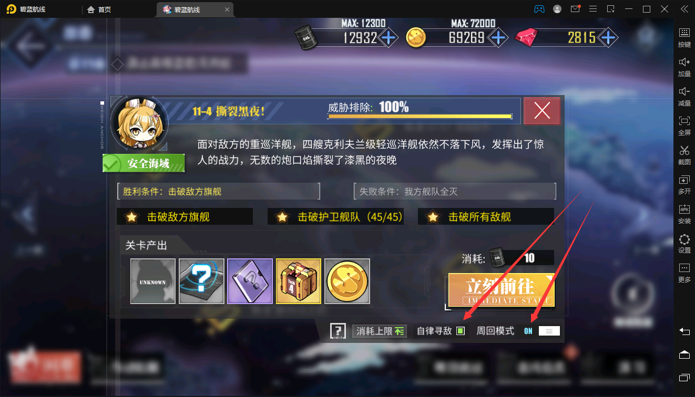

# 碧蓝航线自动化小脚本beta
## 简介
  学了点自动化操作，想着生活本来就很累了，绝不为游戏打工，于是创立了这个项目。 
  在你设定好游戏次数后，本脚本可以帮你帮你一直刷到指定次数，并且可以中途处理清理仓库，给你最极致的游戏体验！ 
  关于反作弊问题，脚本内置了随机点击和间歇点击，以及模糊点击，本人用了差不多两个月目前账号状态良好，（再说咱又没修改内存他凭什么封我！） 
  初学者练手，大佬看了有啥好建议请多多指出，请多关照！
## 使用的扩展库
* pywin, win32gui
* random, time, os, sys
* aircv(基于opencv的扩展库)
* PYQT6
## 关于环境
python 10
本程序基于雷电模拟器，请在雷电模拟器中使用，并且在Contains中将相关参数设置为自己的环境 
启动前请在main.py中初始化自己的设置，添加自己的雷电模拟器地址 
雷电模拟器编号在这里看 
 
请将模拟器的分辨率调成如图（怎么这么多要求，还能不能愉快的游戏了!) 
 
## 如何使用
首先选择好你想刷的关卡，别忘了开自律寻敌和周回模式 
 
进入到图示界面，然后运行程序，输入想要刷的次数（建议最多10次，多了舰娘心情就不好了）  
 
## 未来更新计划
1、GUI  
2、图片识别换成文本识别  
3、学习学习决策树看看有没有什么东西能用上  
## 结语
不是软件工程专业的也算是半个门外汉，除了什么奇奇怪怪的地方或者有什么建议还请大佬指出  
大二课好多都没有什么时间改，结果是随缘更新吧  
## 目前已知bug
请不要将模拟器最小化，会导致截图返回黑屏从而直接报错，可以将模拟器用其他页面覆盖，但请不要点击最小化！！！  
清理仓库的时候同时存在两个确定键小概率会点击错误的那个从而导致报错（实在是没时间改了，虽然很好解决。。。）  
最后的最后，希望各位指挥官能够善待自己的舰娘们，获得良好的游戏体验！

## 更新情况  

#### 2022-10-27
* 更新了最新活动，战斗皇家女仆的活动，优化主程序结构，新活动通过 fight_royal_maid() 函数控制
* 优化了随机坐标的四舍五入，现在不会出现小数点后十几位的情况了
* 忍痛割爱删除了选择舰队与选择关卡功能，将检测其实用性不大
#### 2022-12-31
* 更新了GUI